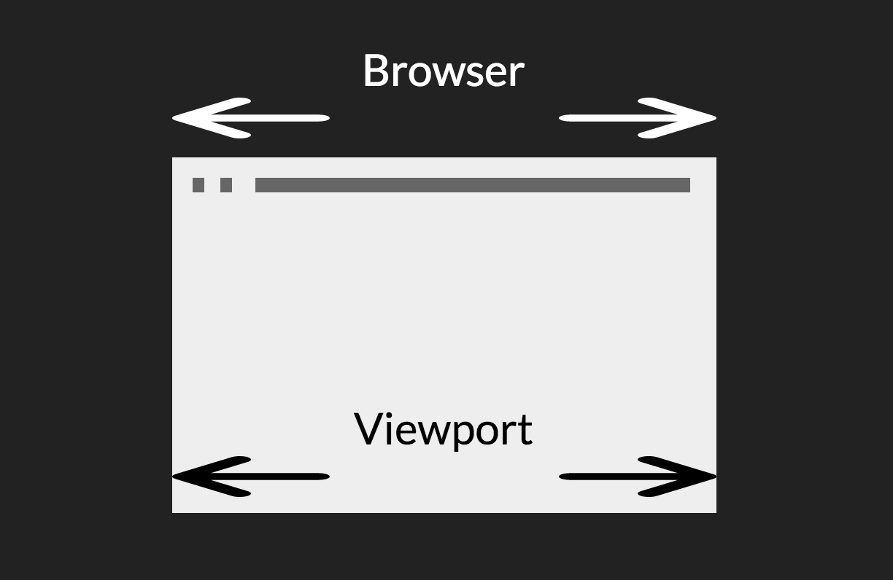
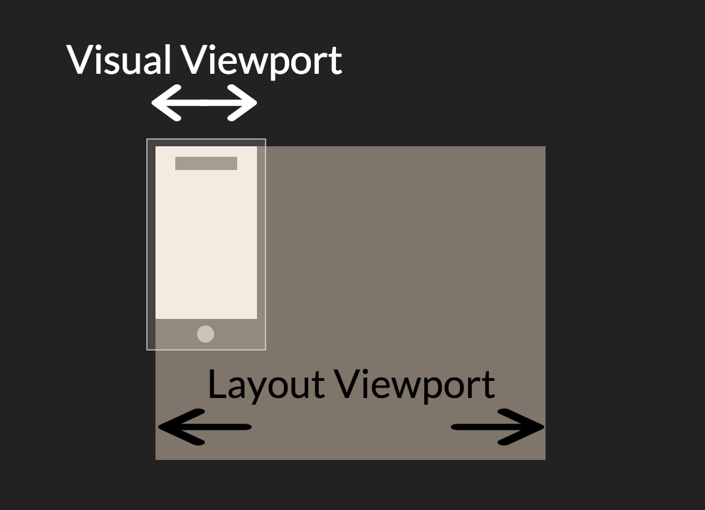
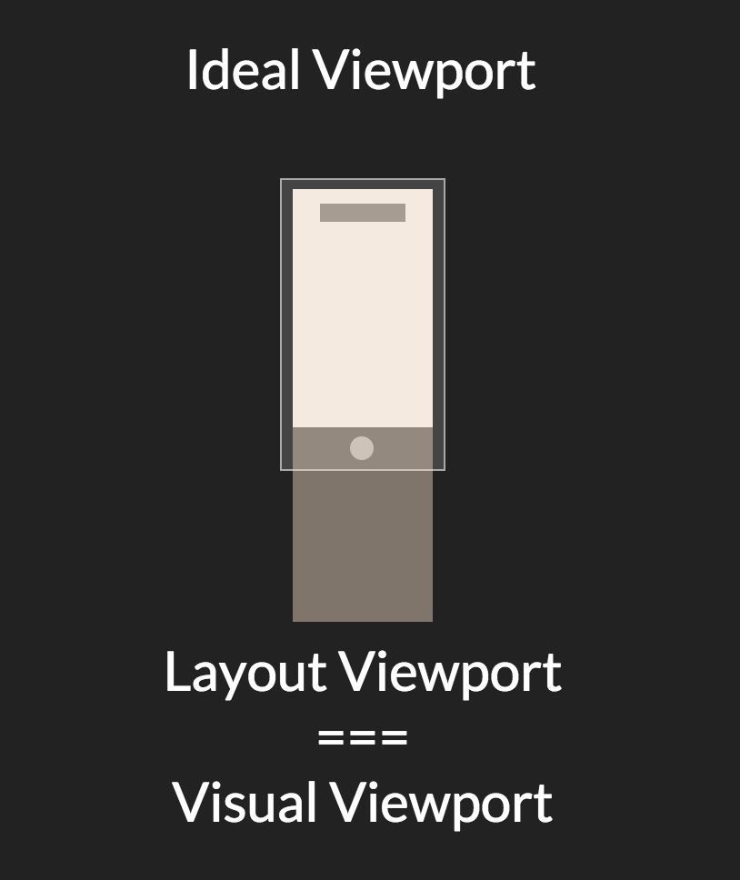

# What makes responsive design work?
## A short story about browsers

---

In this brief introduction I would like to give you an understanding of the mechanisms that make responsive web design possible. I aim not to go into unnecessary details, but to explain concepts at a level web developers can benefit from. I also would like to mention that browsers do things differently, especially in the free land of Android, but this short text has no room for handling inconsistencies between browsers since that is a entire story itself.

## First off, what is a web browser?
A web browser is a computer program which lets the user view and interact with web pages. Technically, a browser (i.e. Google Chrome or Firefox) is of a computer program that runs natively on the current operating system. That program handles things like window management, tabs, bookmarks and more. It also uses a "rendering engine" to calculate what should be shown in the greater part of the interface. The browser is provided a url (usually the user writing in the address bar or clicking a link) which it passes to the rendering engine along with a surface that is used to paint the interface on.

Historically browsers tend to do the rendering task somewhat different. Which is a subject of its own, but let's stick to the subject and move on.

## Responsive web design
Responsive web design is, [according to Wikipedia](https://en.wikipedia.org/wiki/Responsive_web_design) "an approach to web design aimed at crafting sites to provide an optimal viewing and interaction experience — easy reading and navigation with a minimum of resizing, panning, and scrolling—across a wide range of devices (from desktop computer monitors to mobile phones)". The practical translation for a web developer is that we want complete control of the screen area and the interface we put on it has to have the right size for interaction and viewing.

But mobile and desktop screens have different size and ratio and they have different types of input devices. This implies that interfaces need to be customized for the target screen and input device.

# Show me the code
Let's dive right in and look at some code. Assume the following markup and styling for a web page:

	<html>
		<head>
			
		</head>
	    <body>
	        

Hello

	    </body>
	</html>

This will result with the div #something to have the width of 35% of the parent element, `<body>`. The `<body>` element will take up 100% of the width of the `<html>` element. Then what, how wide is the `<html>` element?

## The viewport
The uppermost building block of a web layout is called the viewport. It's what contains the `<html>` element. It's the outer limits for the rendering engine to work with.

When dealing with responsive web design, control of the viewport is what really enables us to produce interfaces for all screen sizes.

### Let's invent the mobile internet
Image you have the task to make internet work nice on mobile screens. There are neither previous mobile browsers nor web pages optimized for mobility. To make the "mobile internet" gain any popularity, it surely needs to work with every existing web page out there, or at least close to. So before even trying to make responsive web design, we need to address existing content first.

### How existing web pages work
Web pages are styled using fixed pixel sizes, percentage expressions and other measurements. Consider a menu on the side of the page which is styled using a percentage width. On a mobile screen that might end up in such a narrow band that none of the text fits. (You may notice that I omit 'height', that is because the height of a web page is most often variable and is not as important when dealing with responsive design as the width.)

On mobile the rendering engine needs to believe that the target area is more pixels wide than it physically is. So the interface gets painted to more pixels than the phone has. The canvas is then zoomed out to show the complete interface on the screen.

As you might have guessed, we need to tamper with the viewport. The viewport would logically get the width of the mobile browser, thus the physical width of the mobile device. But it is not, it gets another width decided by the creator of the browser. This width differs between browsers and device vendors, but span 768-1024px. If a mobile browser tells the rendering engine that it is 980px wide it will render the example #something div 35% of 980px = 343px wide. The interface drawn for 980px will then be zoomed out to fit the mobile device. This way existing web pages will render correctly to mobile browsers, but we haven't yet touched any responsive behavior.

### A note on higher resolutions
Recent models of computer screens and mobile devices often have higher resolution than prior models. More dense pixels would logically end up in interfaces being drawn at smaller sizes than before. But we know that they are not, web pages didn't shrink to half the size when the Mac got its retina display. The abstraction we look for is called devicePixelRatio.

Try and type in `devicePixelRatio` to your browser developer console, what comes out? On recent Macbooks it says 2, on older it says 1. It can be any fractional number though. This is a number that affects the width communicated to the rendering engine. For a screen that has a devicePixelRatio = 2 the number of physical pixels gets divided by 2 before going in to the rendering engine. That way a browser that takes up 1400 physical pixels only communicate 1400 / 2 = 700px to the rendering engine. That's why CSS that targets 700px gets interpreted the same way without you having to manually deal with screen resolutions.

Imagine some years from now, where no device have devicePixelRatio = 1 any more. It will be weird to write CSS targeting pixel sizes that no device have.

## What sets mobile apart from desktop?
Let's introduce some proper names for the things we've just talked about. On a desktop browser there is the `viewport`, which has the same width as the browser window, (although altered at higher resolutions). On mobile though it's slightly more complicated.

### Layout, visual and ideal viewport
The rendering engine operates on what's called the `layout viewport` and the physical pixels of the device makes the `visual viewport`, (The media queries we declare in CSS targets the layout viewport).

The third and last viewport, the `ideal viewport`, is an abstract notion of the best layout viewport for a particular device. The ideal viewport might as well be `physical pixels / devicePixelRatio`, but in many cases it differs slightly from that (see this list for details: TODO). Luckily the developer has an easy way of using the ideal viewport:

    <meta name="viewport" content="width=device-width,initial-scale=1">

This declaration is the meta viewport tag and it goes inside of the `<head>` section of the HTML. The `width=device-width` command tells the rendering engine to use the ideal viewport as layout viewport when it renders the web page. There are more options to this meta tag, summarized by [Peter-Paul Koch at Quirksmode](http://www.quirksmode.org/mobile/metaviewport/)

## Where to go from here
By now you hopefully have the understanding of why media queries work the way they do and a little bit of history about the challenges with web development for mobile devices. This short article does not cover the actual use of media queries, although I provided some good links to further reading and more comprehensive guides to that.

- [Quirksmode - Mobile](http://www.quirksmode.org/mobile/)
- [Apple - Supported meta tags: viewport](https://developer.apple.com/library/iad/documentation/AppleApplications/Reference/SafariHTMLRef/Articles/MetaTags.html#//apple_ref/doc/uid/TP40008193-SW6)
- [CSS-TRICKS - CSS Media Queries & Using Available Space](https://css-tricks.com/css-media-queries/)
